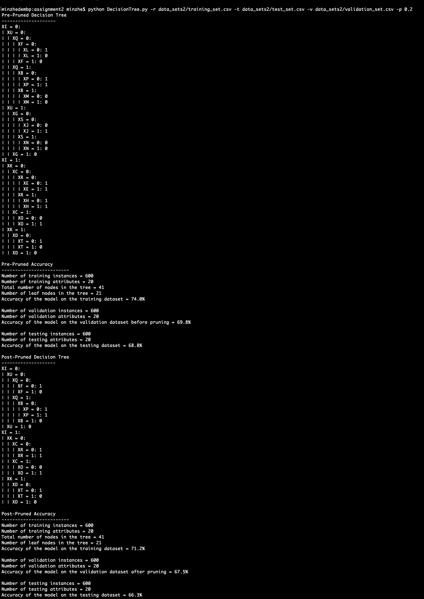

# Decision Tree
6375 Machine Learning assignment2 part ii programming

## Requirement
* The program is written in python 3
* The program needs python modules `argparse`, `numpy` and `pandas`

## Assumption
* Split node: I first split node which has the minimum depth.
* Prune: I randomly prune one node from all leaf nodes in the tree in one round pruning.

## Usage
* The python script `DecisionTree.py` should take four parameters. type `python DecisionTree.py -h` to see the help message.
* `-r` the path of training data
* `-v` the path of validation data
* `-t` the path of the test data
* `-p` pruning factor
* demo run `python DecisionTree.py -r data_sets1/training_set.csv -t data_sets1/test_set.csv -v data_sets1/validation_set.csv -p 0.2`

## Result
* Result on dataset1

* Result on dataset2
